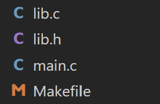
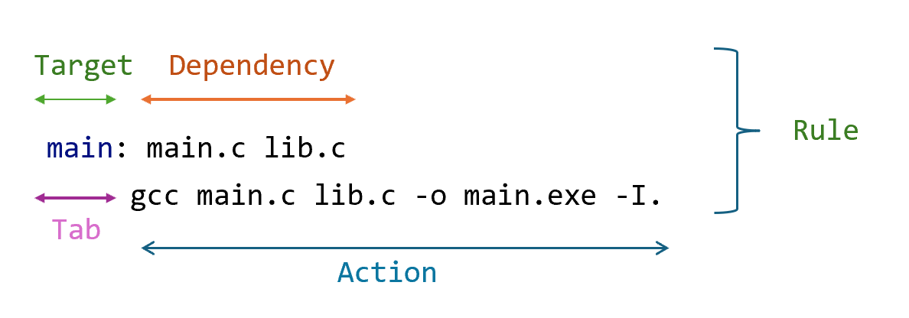

Tài liệu tham khảo:

- https://www.gnu.org/software/make/manual/make.html#Rule-Syntax
- https://github.com/Leminuos/makefile/blob/master/Makefile

# MAKEFILE CƠ BẢN

- Nội dung: 12 Phần
- Mục tiêu: có thể viết được makefile để build cho các dự án vừa và nhỏ

---

# PHẦN 1: GIỚI THIỆU VỀ MAKEFILE

- Bản chất makefile dùng để thực thi các command
- Khi dùng makefile để rebuild một dự án, nó sẽ chỉ build lại những file đã thay đổi giúp giảm thời gian rebuild

# PHẦN 2: CÁCH BUILD FILE .c BẰNG GCC

## 2.1 Có 1 file main.c duy nhất

Có chương trình như sau:

```c
#include <stdio.h>
int main(){
    printf("Hello world");
    return 0;
}
```

Cách build với gcc

```bash
gcc main.c -o main.exe
```

Trong đó:

- "-o": output
- "main.c": file cần biên dịch
- "main.exe": file output

## 2.2 Có nhiều file .c, .h link với nhau

### Cấu trúc thư mục hiện tại như sau



### Cách 1: Compile từng file rồi link

B1: Từng file.c build ra từng file .o  
B2: Link các file .o đó lại với nhau

```cpp
--> gcc -c main.c -o main.o           -> Build ra file main.o
--> gcc -c lib.c -o lib.o             -> Build ra file lib.o
--> gcc main.o lib.o -o main.exe      -> Build ra file main.exe là file để chạy của chương trình
```

Trong đó

- "-c"(Compile only) : chỉ biên dịch file nguồn thành file .o, không thực hiện linking.
- "-o" : link các file .o, tạo ra file output

### Cách 2: Compile trực tiếp nhiều file cùng lúc

```bash
--> gcc main.c lib.c -o main.exe -I.  -> Build ra file main.exe là file chạy của chương trình
```

Về `-I`

- `-I` : thêm đường dẫn tìm kiếm header file
- `.` : thư mục hiện tại  
  --> Với project lớn có nhiều source file, việc build thủ công sẽ trở nên phức tạp và mất thời gian.  
  --> Makefile được sử dụng để tự động hóa quá trình build và quản lý dependency.

# PHẦN 3: RULE CỦA MAKEFILE CƠ BẢN

## Tổng quan



- `rule` là đơn vị cơ bản mô tả:  
  “Muốn tạo ra file này thì cần những file nào và phải chạy lệnh gì”
- `target`: Mục tiêu cần tạo ra.  
   Ví dụ:
  ```bash
  main
  ```
  thường là file executable.
- `dependencies`: Những file mà target phụ thuộc vào. Nếu các file này thay đổi thì target sẽ được build lại.  
  Ví dụ:
  ```bash
  main.c lib.c
  ```
- `Tab`: Dòng command bắt buộc phải bắt đầu bằng ký tự TAB thật, không phải spaces.
- `action / commands` : Các lệnh shell sẽ được thực thi để build target

## Ví dụ:

```makefile
main.o: main.c
	gcc -c main.c -o main.o
lib.o: lib.c
	gcc -c lib.c -o lib.o
clean:
	rm -f *.exe *.o
app: main.o lib.o
	gcc main.o lib.o -I. -o app
```

Ta chạy các rule như sau:

```bash
make clean
make app
./app
```

Kết quả nhận được:

```bash
PS C:\Users\ADMIN\Desktop\test> make clean
rm -f *.exe *.o
PS C:\Users\ADMIN\Desktop\test> make app
gcc -c main.c -o main.o
gcc -c lib.c -o lib.o
gcc main.o lib.o -I. -o app
PS C:\Users\ADMIN\Desktop\test> ./app
Hello world
function hello
```

# PHẦN 4: BIẾN TRONG MAKEFILE

## Tổng quan

Biến trong makefile được khởi tạo như sau:

```c
NAME = VALUE
```

Các kiểu gán:

| Cú pháp | Ý nghĩa                          |
| ------- | -------------------------------- |
| `=`     | Gán lười (đánh giá khi dùng)     |
| `:=`    | Gán ngay (đánh giá khi khai báo) |
| `?=`    | Chỉ gán lười nếu chưa có giá trị |
| `+=`    | Nối thêm nội dung                |

Biến được call bằng

```c
${NAME} hoặc $(NAME)
```

## Ví dụ

```bash
CC = gcc
main.o: main.c
	${CC} -c main.c -o main.o
lib.o: lib.c
	${CC} -c lib.c -o lib.o
clean:
	rm -f *.exe *.o
app: main.o lib.o
	${CC} main.o lib.o -I. -o app
```

# PHẦN 5: TẠO MỘT MAKEFILE CƠ BẢN

```bash
CC=gcc
CFLAGS=-I.

main: main.c lib.c
	$(CC) main.c lib.c -o main.exe $(CFLAGS)
```

--> Đoạn makefile trên sau khi chạy câu lệnh make main thì sẽ cho ra main.exe: là file chạy của chương trình

# PHẦN 6: WILDCARDS/PATTERNS VÀ AUTOMATIC VARIABLE

Wildcards/Patterns và Automatic Variables là hai “vũ khí mạnh nhất” giúp Makefile ngắn gọn và tự động hóa.

## 1. Wildcards / Pattern

### 1.1. Wildcard `*`

Dùng để đại diện cho nhiều file.

#### Ví dụ:

Thư mục hiện tại:

```bash
main.c
lib.c
test.c
```

Khi dùng:

```bash
$(wildcard *.c)
```

Kết quả:

```bash
main.c lib.c test.c
```

### 1.2. Pattern `%`

Pattern `%` dùng để đại diện cho phần tên file chung.

#### Ví dụ

```bash
%.o: %.c
```

Rule trên có nghĩa là:

> Mọi file .o đều có thể được build từ file .c tương ứng.

```bash
main.o <- main.c
test.o <- test.c
lib.o  <- lib.c
```

Ở đây:

```bash
% = main
% = test
% = lib
```

## 2. Automatic Variables

Là các biến đặc biệt do make tự sinh ra.

### Quan trọng nhất:

| Variable | Ý nghĩa              |
| -------- | -------------------- |
| `$@`     | target hiện tại      |
| `$<`     | dependency đầu tiên  |
| `$^`     | toàn bộ dependencies |

### Ví dụ:

```bash
%.o: %.c
	gcc -c $< -o $@
```

Nếu đang build:

```bash
main.o từ main.c
```

thì make tự thay:

```bash
$@ -> main.o
$< -> main.c
```

=> thành:

```bash
gcc -c main.c -o main.o
```

### Ví dụ hoàn chỉnh

```bash
CC = gcc
%.o: %.c
	${CC} -c $< -o $@
clean:
	rm -f *.exe *.o
app: main.o lib.o
	${CC} main.o lib.o -I. -o app
```

Chạy

```bash
PS C:\Users\ADMIN\Desktop\test> make clean
rm -f *.exe *.o
PS C:\Users\ADMIN\Desktop\test> make app
gcc -c main.c -o main.o
gcc -c lib.c -o lib.o
gcc main.o lib.o -I. -o app
PS C:\Users\ADMIN\Desktop\test> ./app
Hello world
function hello
```

## Vì sao chúng quan trọng?

Vì nếu không có chúng:

- Makefile cực dài
- phải viết rule lặp đi lặp lại
- khó maintain

### Ví dụ project 100 file .c:

❌ Không dùng pattern:

```bash
a.o: a.c
...

b.o: b.c
...

c.o: c.c
...
```

✅ Có pattern:

```bash
%.o: %.c
	gcc -c $< -o $@
```

# PHẦN 6.1: IMPLICIT RULE VÀ EXPLICIT RULE

## 1. Explicit Rule

Là rule được người dùng định nghĩa tường minh, chỉ rõ:

- Target
- Dependency (Prerequisite)
- Command

Ví dụ:

```make
main.o: main.c
	gcc -c main.c -o main.o
lib.o: lib.c lib.h
	gcc -c lib.c -o lib.o -I.
```

## 2. Implicit Rule

Là rule mà Make tự suy luận cách build target thay vì người dùng phải viết đầy đủ cho từng file.  
Ví dụ:

```make
CC = gcc
CFLAGS = -I.

app: main.o lib.o
        $(CC) $^ -o $@ $(CFLAGS)
```

Khi chạy:

```bash
make app
```

Make nhận thấy cần `main.o` và `lib.o`.

Nếu các file `.o` chưa tồn tại nhưng có:

```text
main.c
lib.c
```

Make sẽ tự sử dụng rule ngầm định:

```make
%.o: %.c
	$(CC) -c $< -o $@
```

để tạo:

```bash
gcc -c main.c -o main.o
gcc -c lib.c -o lib.o
```

# PHẦN 7: PHONY TARGET

Sẽ ra sao nếu các target của chúng ta trùng với tên file, ví dụ ta có lệnh:

```bash
clean:
	rm -f *.o *.exe
```

Và ta có file "clean" trùng với target ở trên thì điều gì sẽ xảy ra
Kết quả:

```bash
make: 'clean' is up to date.
```

--> Để tránh điều đó, chúng ta sửa thành

```bash
.PHONY: clean
clean:
	rm -f *.o *.exe
```

Một số chuẩn phony hay dùng:

| Target    | Function                                                     |
| --------- | ------------------------------------------------------------ |
| all       | Thực hiện build toàn bộ                                      |
| install   | Tạo bản cài đặt của ứng dụng từ việc compile binary          |
| clean     | Xóa binary file được tạo từ source                           |
| distclean | Xóa tất cả các file được tạo ra mà ko nằm trong source chính |
| TAGS      | Tạo bảng tag để editor dùng                                  |
| info      | Tạo GNU info file từ textinfo source                         |
| check     | Chạy bất kỳ test nào tương ứng với chương trình              |

# PHẦN 8: AUTOMATIC VARIABLE

| Automatic Variable | Dễ hiểu là gì                             | Ví dụ              |
| ------------------ | ----------------------------------------- | ------------------ |
| `$@`               | Tên target hiện tại                       | `app`, `main.o`    |
| `$<`               | File phụ thuộc đầu tiên                   | `main.c`           |
| `$^`               | Toàn bộ dependencies (không lặp)          | `main.c lib.c`     |
| `$+`               | Toàn bộ dependencies (có giữ bản sao lặp) | `a.c a.c b.c`      |
| `$?`               | Những dependency mới hơn target           | các file vừa sửa   |
| `$*`               | Tên file không có đuôi mở rộng            | `main` từ `main.o` |
| `$%`               | Tên member trong archive (`.a`)           | ít dùng            |

# PHẦN 9: VPATH VÀ CFLAGS TRONG MAKEFILE

| Biến     | Vai trò                 | Dành cho ai             |
| -------- | ----------------------- | ----------------------- |
| `VPATH`  | giúp `make` tìm file    | dành cho make           |
| `CFLAGS` | đưa option cho compiler | dành cho compiler (gcc) |

## 1. VPATH là gì?

VPATH dùng để chỉ cho make biết:

> Nếu không tìm thấy file ở thư mục hiện tại thì hãy tìm thêm ở đâu.

### Ví dụ:

```bash
VPATH = src include lib
```

Nghĩa là khi make cần tìm file:

- main.c
- utils.c
- config.h

Nó sẽ tìm lần lượt ở:

- thư mục hiện tại(root)
- src/
- include/
- lib/

### Ví dụ thực tế:

Cấu trúc project:

```bash
project/
├── Makefile
├── src/
│   └── main.c
└── include/
    └── config.h
```

Makefile:

```bash
VPATH = src include

main: main.c
	gcc main.c -o main
```

Dù main.c không nằm cạnh Makefile, make vẫn tìm được vì có VPATH.

### Điểm dễ nhầm:

`VPATH` chỉ giúp make tìm file dependency, Compiler (gcc) muốn tìm header thì vẫn cần: `-Iinclude`, tức là phải thêm vào CFLAGS.

## 2. CFLAGS là gì?

CFLAGS là biến chứa:

> các option/compiler flags dùng khi compile code C

### Một số flag phổ biến

| Flag        | Ý nghĩa               |
| ----------- | --------------------- |
| `-Wall`     | warning cơ bản        |
| `-Wextra`   | warning nâng cao      |
| `-g`        | thêm debug symbol     |
| `-O0`       | không tối ưu          |
| `-O2`       | tối ưu                |
| `-Iinclude` | thêm đường dẫn header |
| `-std=c11`  | dùng chuẩn C11        |

### Ví dụ đầy đủ

```bash
CC = gcc

VPATH = src include

CFLAGS = -Wall -Iinclude

main: main.c
	$(CC) $(CFLAGS) main.c -o main
```

Ý nghĩa:

- make sẽ tìm main.c trong src/ hoặc include/
- compiler sẽ tìm header trong include/
- bật warning với -Wall

# PHẦN 10: FOREACH TRONG MAKEFILE

Khi Makefile bắt đầu có:

- nhiều source file
- nhiều thư mục
- nhiều object file

thì ta thường cần:

> lặp qua một danh sách để xử lý từng phần tử

`foreach` là một function xử lý text, được sinh ra để làm việc đó.

## Khi nào dùng foreach?

Ví dụ có nhiều file .c:

```bash
main.c lib.c test.c
```

Ta muốn tự động tạo:

```bash
main.o lib.o test.o
```

Thay vì viết tay từng file:

```bash
OBJ = main.o lib.o test.o
```

ta muốn Makefile tự xử lý.  
Đây là lúc foreach hữu ích.

## Cú pháp

```bash
$(foreach var,list,text)
```

| Thành phần | Ý nghĩa           |
| ---------- | ----------------- |
| `var`      | biến tạm          |
| `list`     | danh sách cần lặp |
| `text`     | nội dung xử lý    |

## Ví dụ đầu tiên

```bash
SRC = main.c lib.c test.c

OBJ = $(foreach file,$(SRC),$(file:.c=.o))

all:
	echo $(OBJ)
```

Kết quả:

```bash
main.o lib.o test.o
```

### Giải thích từng bước:

Danh sách ban đầu:

```bash
main.c lib.c test.c
```

foreach sẽ lần lượt:

```bash
file = main.c
file = lib.c
file = test.c
```

Mỗi lần lặp sẽ chạy:

```bash
$(file:.c=.o)
```

tức là:

```bash
đổi .c -> .o
```

## Ứng dụng thực tế

### 1. Thêm path cho source file

```bash
SRC = main.c lib.c

FULL = $(foreach s,$(SRC),src/$(s))
```

Kết quả:

```bash
src/main.c src/lib.c
```

### 2. Tạo object files

```bash
SRC = main.c lib.c

OBJ = $(foreach s,$(SRC),$(s:.c=.o))
```

Kết quả:

```bash
main.o lib.o
```

# PHẦN 11: TỰ ĐỘNG SINH DEPENDENCY VỚI -MMD -MP

> Dependency là các tệp mà Make theo dõi timestamp để quyết định target có cần build lại hay không.


Nếu ta khai báo `dependency` như trong ảnh thì nếu `lib.h` **_bị thay đổi_** nhưng khi build lại target `main` thì sẽ hiện :

```make
hao@hao-virtual-machine:~/Desktop$ make main
make: 'main' is up to date.
```

bởi vì Makefile chỉ quan tâm đến các dependency có bị thay đổi không (`main.c` và `lib.c`).  
Giải pháp là thêm `lib.h` vào dependency  
Nhưng nếu một project lớn, các file `.h` chồng chéo nhau thì sẽ rất khó để liệt kê hết các file `.h` vào dependency.

**_=> *SỬ DỤNG `-MMD -MP` ĐỂ TỰ ĐỘNG SINH DEPENDENCY*_**

> `-MMD`: Tự động tạo file dependency (.d) từ các lệnh `#include`, giúp Make biết cần rebuild khi file header thay đổi.

> `-MP`: Tạo các target rỗng cho file header, giúp Make không báo lỗi khi một header bị xóa hoặc đổi tên.

Tóm lại, từ một đoạn Makefile kiểu cũ:

**Dạng thư mục**

1. Dạng ngang hàng

```
project/
├── Makefile
├── main.c
├── lib.c
├── lib.h
└── README.md
```

```make
CC = gcc
%.o: %.c
	${CC} -c $< -o $@
clean:
	rm -f app *.o
app: main.o lib.o
	${CC} main.o lib.o -I. -o app
```

ta **nâng cấp** lên thành:

```make
CC = gcc
SRC = main.c lib.c

CFLAGS += -MMD -MP
OBJ = $(SRC:.c=.o)
DEP = $(OBJ:.o=.d)

app: $(OBJ)
	$(CC) $^ -o $@

-include $(DEP)

.PHONY: clean
clean:
	rm -f app $(OBJ) $(DEP)
```

2. Dạng có chia thư viện

```
linked_list_management/
├── main.c
├── Makefile
└── lib/
    ├── quanly.c
    └── quanly.h
```

Tối ưu:

```make
CC := gcc

TARGET := app

SRC := main.c \
 lib/quanly.c

OBJ := $(SRC:.c=.o)
DEP := $(OBJ:.o=.d)

CFLAGS := -Wall -Wextra -std=c11 -Ilib -MMD -MP

$(TARGET): $(OBJ)
$(CC) $^ -o $@

-include $(DEP)

.PHONY: clean

clean:
rm -f $(TARGET) $(OBJ) $(DEP)
```
